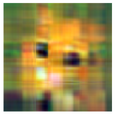
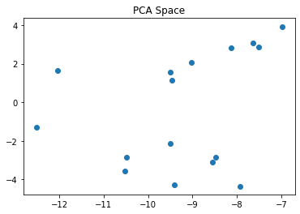

# Project 2 NLA Report - Mateusz Dorobek
The goal of this project is to discuss some common applications of the SVD decomposition.

# Least Squares method

Least squares is a method to approximate solution in over-determined system, where:
$
A \in {\rm I\!R}^{mxn}, 
b \in {\rm I\!R}^{m}, 
m \geq n, 
x_{LS} \in {\rm I\!R}^{n}
$
such that it minimizes norm  $\left\Vert Ax_{LS}-b \right\Vert _2$
In this exercise I used two method of factorization (OR and SVD) to solve the Least Squares problem. Each time I'll test two datasets: `dades.txt` and `dades_regressio.csv`, which corresponds to full rank and rank deficient problem.


```python
from matplotlib import pyplot as plt
import pandas as pd
import numpy as np
import scipy.linalg as sc
```


```python
def load_data_task1():
    dades = pd.read_csv("dades.txt", header=None, sep="   ", engine="python").values
    A = dades[:, 0]
    b = dades[:, 1]
    return A, b


def load_data_task2():
    dades_regressio = pd.read_csv("dades_regressio.csv", header=None).values
    A = dades_regressio[:, :-1]
    b = dades_regressio[:, -1]
    return A, b


def plot_data1(A, solution, b):
    A_sorted, b_sorted = zip(*sorted(zip(A, b)))
    plt.plot(A_sorted, b_sorted)
    A_sorted, solution_sorted = zip(*sorted(zip(A, solution)))
    plt.plot(A_sorted, solution_sorted)
    plt.gcf().set_size_inches(2, 1)
    plt.show()


def generate_poly_matrix(A, dim):
    assert isinstance(dim, int)
    assert dim > 0
    return np.vstack([A ** d for d in range(dim)]).T


def least_squares_qr(A, b, plot=1):
    Q, R = np.linalg.qr(A)
    rank = min(R.shape)
    m, n = A.shape
    assert A.shape[0] == b.shape[0]
    assert A.shape[0] >= A.shape[1]
    y = Q.T @ b
    y1 = y[:n]
    y2 = y[n:]
    R1 = R[:n, :n]
    x = sc.solve_triangular(R1, y1)
    v = np.zeros(n - rank)
    x_qr = np.concatenate((x, v))
    if plot:
        plot_data1(A[:, 1], A @ x, b)
    return x_qr


def least_squares_svd(A, b, plot=1):
    U, S, V = np.linalg.svd(A, full_matrices=False)
    n = A.shape[1]
    S[S < 1e-5] = 0
    r = np.sum(S > 0)
    S = np.hstack([1 / S[:r], np.zeros(n - r)])
    A_plus = (V.T * S).dot(U.T)
    x_svd = A_plus.dot(b)
    if plot:
        plot_data1(A[:, 1], A @ x_svd, b)
    return x_svd
```

## Full Rank Matrix


```python
# np.set_printoptions(precision=10, suppress=False)
A, b = load_data_task1()
for dim in range(2, 6):
    print("Dim =", dim)
    A_poly = generate_poly_matrix(A, dim)
    x_svd = least_squares_svd(A_poly, b)
    print("\tError SVD =", np.linalg.norm(A_poly.dot(x_svd) - b))
    x_qr = least_squares_qr(A_poly, b)
    print("\tError QR =", np.linalg.norm(A_poly.dot(x_qr) - b))
    print("-" * 40)
    
    
print("Error SVD =", np.linalg.norm(A_poly.dot(x_svd) - b))
print("Norm(x_svd) =", np.linalg.norm(x_svd))
print("Error QR =", np.linalg.norm(A_poly.dot(x_qr) - b))
print("Norm(x_qr) =", np.linalg.norm(x_qr))
print("Error SVD - Error QR =", np.linalg.norm(A_poly.dot(x_svd) - b) - np.linalg.norm(A_poly.dot(x_qr) - b))
print("Norm(x_svd-x_qr) =", np.linalg.norm(x_svd-x_qr))
```

Dim = 2


Error SVD = 37.1145797311177


Error QR = 37.11457973111771

Dim = 3


Error SVD = 10.880828401852192


Error QR = 10.88082840185219
Dim = 4


Error SVD = 10.880500221616828


Error QR = 10.880500221616828
Dim = 5


Error SVD = 10.873692595264195


Error QR = 10.873692595264194

-----

```
In summary for dimension = 5

Error SVD = 10.873692595264195
Norm(x_svd) = 2.347791513076133
Error QR = 10.873692595264194
Norm(x_qr) = 2.3477915130765927
Error SVD - Error QR = 1.7763568394002505e-15
Norm(x_svd-x_qr) = 6.951524661147564e-13
```

## Comment:
We can see that both methods gives similar solutions for full rank problem. The have similar quality in this task. We can see that dimension of 2 (of polynomial) gives much higher error than dimensions of 3, 4, and so on.

---------
## Not Full Rank Matrix


```python
A, b = load_data_task2()

x_svd = least_squares_svd(A, b, plot=0)
x_qr = least_squares_qr(A, b, plot=0)

print("Error SVD =", round(np.linalg.norm(A.dot(x_svd) - b), 4))
print("Norm(x_svd) =", np.linalg.norm(x_svd))
print("Error QR =", round(np.linalg.norm(A.dot(x_qr) - b), 4))
print("Norm(x_qr) =", np.linalg.norm(x_qr))
print("Error SVD - Error QR =", np.linalg.norm(A.dot(x_svd) - b) - np.linalg.norm(A.dot(x_qr) - b))
print("Norm(x_svd-x_qr) =", np.linalg.norm(x_svd-x_qr))
```

    Error SVD = 1.2548
    Norm(x_svd) = 1613.743297980223
    Error QR = 1.8051
    Norm(x_qr) = 1.2321638024171774e+16
    Error SVD - Error QR = -0.5503028197481197
    Norm(x_svd-x_qr) = 1.2321638024171774e+16

**Comment**:

From results of experiment on not full rank problem we can conclude that both factorization methods worked quite well, but now the difference is bigger. Norm of the QR factorization result is huge that means it lacks regularization, even it has quite good minimization result.

-----------
# Graphics compression

The SVD factorization has the property of giving the best low rank approximation matrix
with respect to the Frobenius and the 2-norm to a given matrix. 

Let $ A_k=\sum_{j=1}^k \sigma_ju_jv^T_j $
where $u_j$ and $v_{i}$ denote the $i$th column of $U$ and $V$. For any matrix B of rank at most k:

$\|A-A_k\|_{F} \leq \|A-B\|_{F}$

Let B minimize $\|A-B\|_{F}^2$ among all rank $k$ or less matrices. Let $V$ be the space
spanned by the rows of $B$. The dimension of $V$ is at most $k$. Since $B$ minimizes $\|A-B\|_{F}^2$
it must be that each row of $B$ is the projection of the corresponding row of $A$ onto $V$, otherwise replacing the row of $B$ with the projection of the corresponding row of $A$ onto
$V$ does not change $V$ and hence the rank of $B$ but would reduce $\|A-B\|_{F}^2$ is
the sum of squared distances of rows of $A$ to $V$. Since $A_k$ minimizes the sum of squared
distance of rows of $A$ to any $k$-dimensional subspace, it follows that $\|A-A_k\|_{F} \leq \|A-B\|_{F}$.

To proof the $2$-norm has the same properity we state following equation: 

$\|A-A_k\|_{2} =  \bigg\| \sum_{j=k+1}^n \sigma_ju_jv^T_j \bigg\|_{2} = \sigma_{k+1}$

Therefore, we need to show that if $ B_{k}=UV^{\top }$  where $U \in $ and $V$ have $k$ columns then $ \|A-A_k\|_{2} = \sigma_{k+1} \leq \|A-B_k\|_{2} $.

Since $V$ has $k$ columns, then there must be a linear combination of the first $k+1$ columns of $V$,  $ w=\gamma _{1}v_{1}+\cdots +\gamma _{k+1} v_{k+1} $.

such that $ Y^{\top }w=0$. Without loss of generality, we can scale $ w$ so that $ \|w\|_{2}=1$ or (equivalently) $ \gamma _{1}^{2}+\cdots +\gamma _{k+1}^{2}=1$. Therefore,

$\|A-B_{k}\|_{2}^{2}\geq \|(A-B_{k})w\|_{2}^{2}=\|Aw\|_{2}^{2}=\gamma _{1}^{2}\sigma _{1}^{2}+\gamma _{2}^{2}\sigma _{2}^{2}+\cdots +\gamma _{k+1}^{2}\sigma _{k+1}^{2}\geq \sigma _{k+1}^{2}$

This proves SVD factorization to have the property of giving the best low rank approximation matrix with respect to the Frobenius and the 2-norm to a given matrix.

Using this property I performed image compression using SVD decomposition. 


```python
def clip(img):
    img[img < 0] = 0
    img[img > 1] = 1
    return img


def compress(img, k):
    U, S, V = np.linalg.svd(img, full_matrices=False)
    img_compressed = U[:, :k] @ (np.diag(S[:k]) @ V[:k, :])
    error = np.linalg.norm(img - img_compressed, ord=2) / np.linalg.norm(img, ord=2)
    return img_compressed, error


def save_images(img, k, name):
    out_img = np.zeros(img.shape)
    total_error = 0
    for i in range(4):
        tmp_img, error = compress(img[:, :, i], k)
        out_img[:, :, i] = tmp_img
        total_error += error
    total_error = str(round(total_error / out_img.shape[2], 4))

    clipped_img = clip(out_img)
    print("k:", k, "error:", total_error)
    plt.imsave("compressed/" + name + "_" + total_error + ".png", clipped_img)
    plt.axis("off")
    plt.imshow(clipped_img)
    plt.show()

for name in ["cat", "sagrada", "gal"]:
    img = plt.imread("images/" + name + ".png")
    print("Image:", name, ", Size:", img.shape[0], "x", img.shape[1])
    for k in [1, 4, 10, 30, 100]:
        save_images(img, k, name)
```

**Image: cat , Size: 128 x 128**
k: 1 error: 0.1402


k: 4 error: 0.0648





k: 10 error: 0.0286


k: 30 error: 0.0089


k: 100 error: 0.0003


**Image: sagrada , Size: 256 x 256**
k: 1 error: 0.1266


k: 4 error: 0.0493


k: 10 error: 0.0251


k: 30 error: 0.0103


k: 100 error: 0.0023


**Image: gal , Size: 568 x 834**
k: 1 error: 0.1857


k: 4 error: 0.0455


k: 10 error: 0.0177


k: 30 error: 0.0044


k: 100 error: 0.0009


**Comment**

Bigger k results in better quality of compression, with smaller error. With decrease of Frobenius norm more information is preserved from original image resulting in better compression quality.

---------------------
# Principal Component Analysis

PCA is technique that reduces dimensions of data by finding its main components with reduced loss of information. In first task I've calculated PCA using covariance and correlation matrix. 


```python
def pca_covariance(x, n=None):
    if n is None:
        n = x.shape[0]
    y = x.T / np.sqrt(n - 1)
    U, S, V = np.linalg.svd(y, full_matrices=False)
    return S**2, V


def pca_correlation(x, n=None, transpose=False):
    if n is None:
        n = x.shape[0]
    std = np.std(x, axis=0)
    if transpose:
        x = x.T
    x = x / std
    return pca_covariance(x, n)


def load_data_example():
    return pd.read_csv("example.dat", header=None, sep=" ", dtype=float).values


def load_data_RCsGoff():
    data = pd.read_csv("RCsGoff.csv")
    X = data.iloc[:, 1:].values.T
    X = X - np.mean(X, axis=0)
    names = data.columns[1:].values
    return X.T, names 
```

## First Task: example.dat

## Correlation PCA


```python
X = load_data_example().T
s2, Vt = pca_correlation(X)

variance = s2 / np.sum(s2)
plt.title("Variance accumulated in each of the principal components")
plt.scatter(range(len(variance)), variance)
plt.show()

std = np.std(Vt, axis=0)
plt.title("Standard deviation of each of the principal components")
plt.scatter(range(len(Vt)), std)
plt.show()

print("\tvariance: ", *variance, sep="\n\t\t")
print("\tstd: ", *std, sep="\n\t\t")


pca_space = np.dot(Vt, X)
plt.title("PCA Space")
plt.scatter(pca_space[0], pca_space[1])
plt.show()

```


    	variance: 
    		0.9411133917998936
    		0.046581718765646436
    		0.009314477917560366
    		0.002990411516899796
    	std: 
    		0.45759095802640654
    		0.3447775332273393
    		0.49827862323589533
    		0.4164821500860359




-------------
## Covariance PCA


```python
X = load_data_example().T
s2, Vt = pca_covariance(X, 58581)

variance = s2 / np.sum(s2)
plt.title("Variance accumulated in each of the principal components")
plt.scatter(range(len(variance)), variance)
plt.show()

std = np.std(Vt, axis=0)
plt.title("Standard deviation of each of the principal components")
plt.scatter(range(len(Vt)), std)
plt.show()

print("\tvariance: ", *variance, sep="\n\t\t")
print("\tstd: ", *std, sep="\n\t\t")

pca_space = np.dot(Vt, X)
plt.title("PCA Space")
plt.scatter(pca_space[0], pca_space[1])
plt.show()
```


    	variance: 
    		0.8918837948264754
    		0.08499604643886598
    		0.01823985062212277
    		0.004880308112535808
    	std: 
    		0.4503267058326211
    		0.4229150698060809
    		0.4991929040269091
    		0.3451885663141795


**Comment**

Covariance First component has smaller variation in comparison to PCA from correlation matrix.

-------------
## Second task: data_RCsGoff

Here I'll perform PCA analysis using covariance matrix and generate required output file.


```python
X, sample_names = load_data_RCsGoff()
s2, Vt = pca_covariance(X, 58581)

variance = s2 / np.sum(s2)
plt.title("Variance accumulated in each of the principal components")
plt.scatter(range(len(variance)), variance)
plt.show()
```


```python
pca_space = np.dot(Vt, X)
plt.title("PCA Space")
plt.scatter(pca_space[0], pca_space[1])
plt.show()
```


**Comment**

In PCA SPACE figure we can see how dependent are first and second components (73% and 16% of data variance). As we can see they are partially correlated, in some parts and different in other parts of chart. Most of variance is in the firs component that may explain this behavior.


```python
scree_plot_treshold = 2e6
plt.plot(s2, "ro-")
plt.plot([scree_plot_treshold] * len(s2), "b-")
plt.show()

print("Number of principal components needed to explain the data sets:")
print("Kraiser rule: ", sum(s2 > 1))
print("Scree plot: ", sum(s2 > scree_plot_treshold))
summed_variance = np.array([sum(variance[:idx+1]) for idx in range(len(variance))])
three_fourth_rule = next(idx+1 for idx, sum_var  in enumerate(summed_variance) if sum_var>0.75)
print("3/4 of the total variance rule: ", three_fourth_rule)
```


    Number of principal components needed to explain the data sets:
    Kraiser rule:  19
    Scree plot:  4
    3/4 of the total variance rule:  2


- **Kraiser rule** tells to drop all components with eigen value smaller than 1
- **Scree test** tells to drop all components lower than elbow. 
- **3/4 of the total variance rule** tells to choose first n components that accumulative variance is higher or equal than 75% 

## Output:
Output file consist of sample name, 20 principal components and variance accumulated in them with the following format:

`Sample,PC1,PC2,. . . ,PC20,Variance`


```python
df = pd.DataFrame(pca_space)
df.insert(0, "name", sample_names, True)
df.insert(len(df.columns), "variance", variance, True) 
df.to_csv("output.txt", index=False, header=False)
```

# Conclusions

This project explain what is SVD decomposition and what are its applications. Tensors have a lot of information about subject that its data describes, we just need how to extract and interpret them

Project 2 Numerical Linear Algebra - **Mateusz Dorobek**
